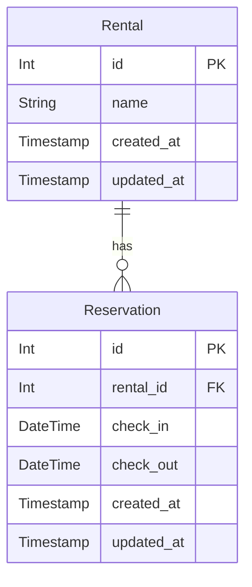
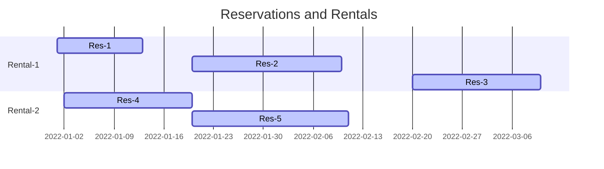

# 🏘️ Rental/Reservation System

We define using `django` MVT a simple system with the following models:

1. `Rental (name)`
2. `Reservation (rental_id, check_in, check_out)`




## 📝 Example 



```
Rental-1
Res-1(2022-01-01, 2022-01-13)
Res-2(2022-01-20, 2022-02-10)
Res-3(2022-02-20, 2022-03-10)

Rental-2
Res-4(2022-01-02, 2022-01-20)
Res-5(2022-01-20, 2022-02-11)
```

View with the table of Reservations with "previous reservation ID".

_Previous reservation_ is a reservation that is before the current one into same
rental.

```
|-----------|--------|----------|----------|------------------------|  
|Rental_name|ID      |Checkin   |Checkout  |Previous reservation, ID|
|-----------|--------|----------|----------|------------------------|
|Rental-1   |Res-1 ID|2022-01-01|2022-01-13| -                      |
|Rental-1   |Res-2 ID|2022-01-20|2022-02-10| Res-1 ID               |
|Rental-1   |Res-3 ID|2022-02-20|2022-03-10| Res-2 ID               |
|Rental-2   |Res-4 ID|2022-01-02|2022-01-20| -                      |
|Rental-2   |Res-5 ID|2022-01-20|2022-01-11| Res-4 ID               |
|-----------|--------|----------|----------|------------------------|
```

### Solution Overview

The problem is to find the previous reservation for each reservation.
This can be done at multiple levels:

1. Database level, by persisting the previous reservation ID into the
   database. --- this would not work when reservation updates check-in/check-out values
2. Model level, (via some derived property) by querying the database 
   for each reservation. --- this would be slow, but would be up-to-date
3. Serializer level, same as model level
4. Selector level, by doing custom SQL queries
      1. inner join
      2. sub-queries
      3. window functions `LAG`
      4. CTE (Common Table Expressions) with recursion
5. View level, by fetching all reservations and then calculating the
   previous reservation for each reservation by looking in the in memory list. 
   --- this would do everything in memory, would be slow for large datasets, 
   and would not work for paginated views

We opted for [`LAG` window function](https://docs.djangoproject.com/en/4.1/ref/models/database-functions/#lag),
because it is efficient, doing everything in one query and has support in all major databases:

1. https://www.sqlitetutorial.net/sqlite-window-functions/sqlite-lag/
2. https://www.postgresql.org/docs/9.1/tutorial-window.html
3. https://www.sqlservertutorial.net/sql-server-window-functions/sql-server-lag-function/

We need to make sure the ordering of the reservations is correct, and we are 
looking into the check-in / check-out date, not by reservation creation id.
We made sure overlapping reservations are not possible in our system if we validate the reservations
before persisting them --- see [`reservation.models.Reservation::_validate_no_overlapping_reservations_within_same_rental`](./reservation/models.py#L27).

Relevant test cases[`reservation.tests.SelectingReservationsWithPreviousReservationRefTest`](./reservation/tests.py#L114):

1. [`test_select_all_reservations_with_previous_reservation`](./reservation/tests.py#L132)
2. [`test_select_all_reservations_with_previous_reservation_for_same_rental_when_out_of_order`](./reservation/tests.py#L159)


## 🚀 Quick Installation

Pre-requisites:

1. Docker
2. `docker-compose`

```
docker-compose up
```

This will start:

1. `dev-server` on port `8000`
2. `dev-test` runner

Sample response:
```
dev-test      | Found 4 test(s).
dev-test      | Creating test database for alias 'default'...
```

```
dev-server    | Starting development server at http://0.0.0.0:8000/
dev-server    | Quit the server with CONTROL-C.
```

Visit `http://localhost:8000/` to see the `reservations` for the sample case.

## 🌎 Deployment

We deployed the simple view to `repl.it`:

> https://gr-alef-bet-bet.roberttodea.repl.co/
