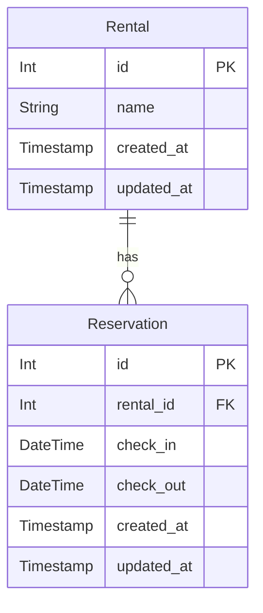
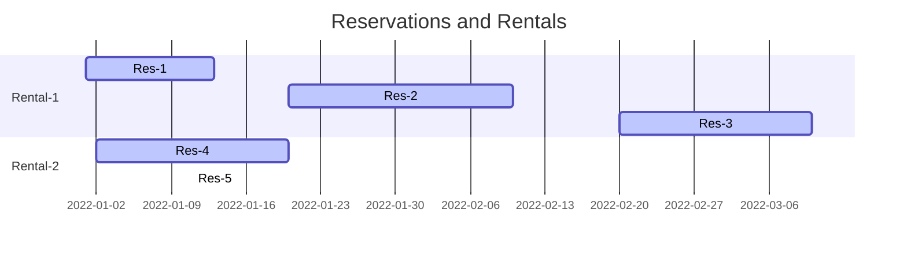

# 🏘️ Rental/Reservation System

We define using `django` MVT a simple system with the following models:

1. `Rental (name)`
2. `Reservation (rental_id, check_in, check_out)`




## 📝 Example 



```
Rental-1
Res-1(2022-01-01, 2022-01-13)
Res-2(2022-01-20, 2022-02-10)
Res-3(2022-02-20, 2022-03-10)

Rental-2
Res-4(2022-01-02, 2022-01-20)
Res-5(2022-01-20, 2022-02-11)
```

View with the table of Reservations with "previous reservation ID".

_Previous reservation_ is a reservation that is before the current one into same
rental.

```
|-----------|--------|----------|----------|------------------------|  
|Rental_name|ID      |Checkin   |Checkout  |Previous reservation, ID|
|-----------|--------|----------|----------|------------------------|
|Rental-1   |Res-1 ID|2022-01-01|2022-01-13| -                      |
|Rental-1   |Res-2 ID|2022-01-20|2022-02-10| Res-1 ID               |
|Rental-1   |Res-3 ID|2022-02-20|2022-03-10| Res-2 ID               |
|Rental-2   |Res-4 ID|2022-01-02|2022-01-20| -                      |
|Rental-2   |Res-5 ID|2022-01-20|2022-01-11| Res-4 ID               |
|-----------|--------|----------|----------|------------------------|
```


## 🚀 Quick Installation

Pre-requisites:

1. Docker
2. `docker-compose`

```
docker-compose up
```

This will start:

1. `dev-server` on port `8000`
2. `dev-test` runner

Sample response:
```
dev-test      | Found 4 test(s).
dev-test      | Creating test database for alias 'default'...
```

```
dev-server    | Starting development server at http://0.0.0.0:8000/
dev-server    | Quit the server with CONTROL-C.
```